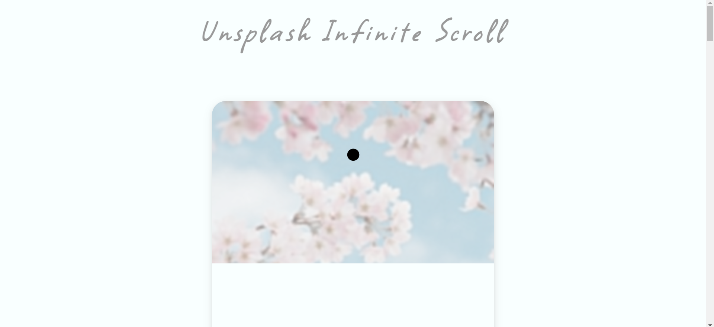
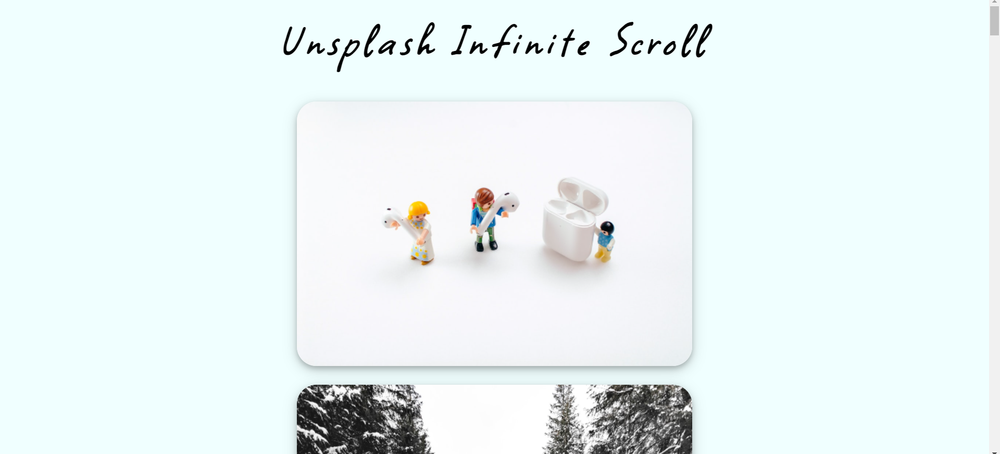

# Unsplash Infinite Scroll
Unsplash Infinite Scroll is a simple website with infinite scroll feature. We have used Unsplash API for extracting images from the Unsplash website.

## Build With :
<ul>
    <li><a href="https://www.w3schools.com/html/" target="_blank">HTML</a></li>
    <li><a href="https://www.w3schools.com/css/" target="_blank">CSS</a></li>
    <li><a href="https://www.w3schools.com/js/" target="_blank">JavaScript</a></li>
</ul>

## Install and Run :

<ol>
    <li>Download the code and extract the zip file.</li>
    <li>Open the folder and double on the file named as <i>"index.html"</i> .</li>
</ol>

## Screenshot :

  
 